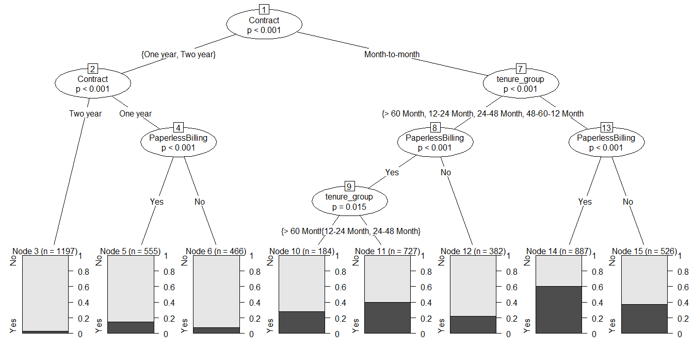

```{r setup, include=FALSE}
knitr::opts_chunk$set(echo = TRUE)
def.chunk.hook  <- knitr::knit_hooks$get("chunk")
knitr::knit_hooks$set(chunk = function(x, options) {
  x <- def.chunk.hook(x, options)
  ifelse(options$size != "normalsize", paste0("\\", options$size,"\n\n", x, "\n\n \\normalsize"), x)
})

```


# Introdução
## Introdução

O avanço da informática e das telecomunicações possibilitou o armazenamento e a distribuição de conjuntos de dados cada vez mais complexos. Lidar com essas bases de dados exigiu a sistematização de diversas técnicas de coleta, tratamento, análise e apresentação de dados. 

\bigskip

Essa sistematização de técnicas deu origem ao que hoje chamamos de \textbf{data science}, cujo objetivo principal é extrair informações úteis de conjuntos de dados aparentemente confusos. 


## Introdução

Algumas aplicações interessantes...

\bigskip


- Identificar mensagens indesejáveis em um e-mail (spam);
  
- Segmentação do comportamento de consumidores para propagandas direcionadas;
  
- Redução de fraudes em transações de cartão de crédito;
  
- Predição de eleições;
  
- Otimização do uso de energia em casas ou prédios;
  
- etc, etc, etc...

## Introdução

De modo a responder esse tipo de pergunta, é necessário cumprir aquelas quatro etapas da ciência de dados. 

\bigskip

\begin{itemize}

  \item É preciso \textbf{coletar} os dados;
  
  \item Dados brutos precisam ser \textbf{tratados};
  
  \item Uma vez disponíveis, os dados precisam ser \textbf{analisados} de forma a extrair informações relevantes e/ou responder determinados questionamentos;
  
  \item Com as respostas em mãos, é preciso \textbf{apresentar} os resultados. 

\end{itemize}


## Introdução

\begin{figure}[ht!]
\centering
\includegraphics[width=90mm]{uff01.png}
\caption{Fonte: \href{http://r4ds.had.co.nz/}{R for Data Science.} \label{figura01}}
\end{figure}

\bigskip

Cada uma dessas etapas exige conhecimentos específicos, de modo a lidar com diferentes formatos de dados, bem como responder questões distintas.

## Introdução

Era necessário construir uma plataforma que unisse todas essas etapas. O \(\mathbf{R}\) é uma das melhores soluções atualmente disponíveis, dados os seguintes motivos:

\bigskip

\begin{itemize}

  \item A existência de uma comunidade grande e bastante entusiasmada, que compartilha conhecimento todo o tempo;
  
  \item o \(\mathbf{R}\) é gratuito, \emph{open source}, de modo que você não precisa comprar licenças de software para instalá-lo;
  
  \item Tem inúmeras bibliotecas (pacotes) em estatística, \emph{machine learning}, visualização, importação e tratamento de dados;
  
  \item Possui uma linguagem estabelecida para \emph{data analysis};
  
  \item Ferramentas poderosas para comunicação dos resultados da sua pesquisa, seja em forma de um website ou em pdf.

\end{itemize}

## Introdução

Ao aprender \(\mathbf{R}\), você conseguirá integrar as etapas de coleta, tratamento, análise e apresentação de dados em um único ambiente. Você vai esquecer ter de abrir o excel, algum pacote estatístico, depois o power point ou o word, depois um compilador de pdf para gerar seu relatório. Todas essas etapas serão feitas em um único ambiente. E essa talvez seja a grande motivação para você entrar de cabeça nesse mundo. 

## Introdução

\begin{figure}[ht!]
\centering
\includegraphics[width=100mm]{rstudio.png}
\caption{Ambiente do RStudio. \label{figura01}}
\end{figure}

## Introdução

\begin{enumerate}

  \item Baixe o \(\mathbf{R}\) em \href{http://cran-r.c3sl.ufpr.br/}{http://cran-r.c3sl.ufpr.br/};
  \item Baixe o \(\mathbf{RStudio}\) em \href{https://www.rstudio.com/products/rstudio/download/}{https://www.rstudio.com/products/rstudio/download/};
  \item Baixe o \(\mathbf{MikTex}\)  \emph{se você for usuário de Windows} em \href{http://miktex.org/download}{http://miktex.org/download};
  \item Baixe o \(\mathbf{MacTex}\) \emph{se você for usuário de Mac} em \href{http://www.tug.org/mactex/}{http://www.tug.org/mactex/}.

\end{enumerate}


# Exemplo: previsão de *Churn* em uma operadora de telecom
## Exemplo: previsão de *Churn* em uma operadora de telecom

A rotatividade de clientes ocorre quando clientes ou assinantes param de fazer negócios com uma empresa ou serviço, também conhecido como atrito com clientes. Também é referido como perda de clientes ou simplesmente *churn*. Um setor no qual as taxas de cancelamento são particularmente úteis é o setor de telecomunicações. Vamos prever a rotatividade de clientes usando um conjunto de dados de telecomunicações disponível no site da IBM, com base em modelos de regressão logística e Árvore de Decisão.

## Pacotes utilizados

```{r, echo=T, eval=T, results='markup', fig.cap='', fig.width=8, fig.height=4, fig.align='center', out.width=".7\\linewidth", warning=FALSE, message=FALSE, size='tiny'}

## Carregar pacotes necessários
library(plyr)
library(corrplot)
library(ggplot2)
library(gridExtra)
library(ggthemes)
library(MASS)
library(caret)
library(randomForest)
library(party)
library(stargazer)
```

## Coleta de Dados

Os dados foram transferidos por download do IBM Sample Data Sets. Cada linha representa um cliente, cada coluna contém os atributos desse cliente:

```{r, echo=T, eval=T, results='markup', fig.cap='', fig.width=8, fig.height=4, fig.align='center', out.width=".7\\linewidth", warning=FALSE, message=FALSE, size='tiny'}
churn <- read.csv('Telco-Customer-Churn.csv')
str(churn)
```

## Coleta de Dados

As variáveis contidas no *dataset* são:

- customerID
- gender (female, male)
- SeniorCitizen (Whether the customer is a senior citizen or not (1, 0))
- Partner (Whether the customer has a partner or not (Yes, No))
- Dependents (Whether the customer has dependents or not (Yes, No))
- tenure (Number of months the customer has stayed with the company)
- PhoneService (Whether the customer has a phone service or not (Yes, No))
- MultipleLines (Whether the customer has multiple lines r not (Yes, No, No phone service)

## Coleta de Dados

- InternetService (Customer’s internet service provider (DSL, Fiber optic, No)
- OnlineSecurity (Whether the customer has online security or not (Yes, No, No internet service)
- OnlineBackup (Whether the customer has online backup or not (Yes, No, No internet service)
- DeviceProtection (Whether the customer has device protection or not (Yes, No, No internet service)
- TechSupport (Whether the customer has tech support or not (Yes, No, No internet service)

## Coleta de Dados

- streamingTV (Whether the customer has streaming TV or not (Yes, No, No internet service)
- streamingMovies (Whether the customer has streaming movies or not (Yes, No, No internet service)
- Contract (The contract term of the customer (Month-to-month, One year, Two year)
- PaperlessBilling (Whether the customer has paperless billing or not (Yes, No))
- PaymentMethod (The customer’s payment method (Electronic check, Mailed check, Bank transfer (automatic), Credit card (automatic)))
- MonthlyCharges (The amount charged to the customer monthly)
- TotalCharges (The total amount charged to the customer)
- Churn ( Whether the customer churned or not (Yes or No))

## Tratamento dos dados

Os dados brutos contém 7043 linhas (clientes) e 21 colunas (recursos). A coluna *Churn* é o nosso alvo. Usamos todas as outras colunas como recursos do nosso modelo. Usamos `sapply` para verificar o número, se houver valores ausentes em cada coluna. Descobrimos que há 11 valores ausentes nas colunas *TotalCharges*. Então, vamos remover essas linhas com valores ausentes.

## Tratamento dos dados

```{r, echo=T, eval=T, results='markup', fig.cap='', fig.width=8, fig.height=4, fig.align='center', out.width=".7\\linewidth", warning=FALSE, message=FALSE, size='tiny'}
sapply(churn, function(x) sum(is.na(x)))
```

## Tratamento dos dados

```{r, echo=T, eval=T, results='markup', fig.cap='', fig.width=8, fig.height=4, fig.align='center', out.width=".7\\linewidth", warning=FALSE, message=FALSE, size='tiny'}
churn <- churn[complete.cases(churn), ]
```

Retirados os *missing values*, agora nós trocamos *No internet service* para *No* em seis colunas: *OnlineSecurity*, *OnlineBackup*, *DeviceProtection*, *TechSupport*, *streamingTV* e *streamingMovies*.

## Tratamento dos dados

```{r, echo=T, eval=T, results='markup', fig.cap='', fig.width=8, fig.height=4, fig.align='center', out.width=".7\\linewidth", warning=FALSE, message=FALSE, size='tiny'}
cols_recode1 <- c(10:15)
for(i in 1:ncol(churn[,cols_recode1])) {
        churn[,cols_recode1][,i] <- as.factor(mapvalues
                                              (churn[,cols_recode1][,i], 
                                                from =c("No internet service"),to=c("No")))
}

```

## Tratamento dos dados

Agora nós trocamos *No phone service* para *No* na coluna *MultipleLines*.


```{r, echo=T, eval=T, results='markup', fig.cap='', fig.width=8, fig.height=4, fig.align='center', out.width=".7\\linewidth", warning=FALSE, message=FALSE, size='tiny'}

churn$MultipleLines <- as.factor(mapvalues(churn$MultipleLines, 
                                           from=c("No phone service"),
                                           to=c("No")))
```

## Tratamento dos dados

A posse (*tenure*) mínima de uma linha nessa empresa é de um mês e a máxima de é de 72 meses. Nós podemos agrupar essa posse em cinco categorias: “0–12 Month”, “12–24 Month”, “24–48 Months”, “48–60 Month” e “> 60 Month”.

\bigskip

```{r, echo=T, eval=T, results='markup', fig.cap='', fig.width=8, fig.height=4, fig.align='center', out.width=".7\\linewidth", warning=FALSE, message=FALSE, size='tiny'}
min(churn$tenure); max(churn$tenure)
```

\bigskip

```{r, echo=T, eval=T, results='markup', fig.cap='', fig.width=8, fig.height=4, fig.align='center', out.width=".7\\linewidth", warning=FALSE, message=FALSE, size='tiny'}

# Criar função
group_tenure <- function(tenure){
    if (tenure >= 0 & tenure <= 12){
        return('0-12 Month')
    }else if(tenure > 12 & tenure <= 24){
        return('12-24 Month')
    }else if (tenure > 24 & tenure <= 48){
        return('24-48 Month')
    }else if (tenure > 48 & tenure <=60){
        return('48-60 Month')
    }else if (tenure > 60){
        return('> 60 Month')
    }
}
```

## Tratamento dos dados

```{r, echo=T, eval=T, results='markup', fig.cap='', fig.width=8, fig.height=4, fig.align='center', out.width=".7\\linewidth", warning=FALSE, message=FALSE, size='tiny'}

# Aplicar função sobre coluna tenure
churn$tenure_group <- sapply(churn$tenure,group_tenure)
churn$tenure_group <- as.factor(churn$tenure_group)
```

## Tratamento dos dados

Agora, mudamos os valores na coluna “SeniorCitizen” de 0 e 1 para “No” ou “Yes”.

\bigskip

```{r, echo=T, eval=T, results='markup', fig.cap='', fig.width=8, fig.height=4, fig.align='center', out.width=".7\\linewidth", warning=FALSE, message=FALSE, size='tiny'}

churn$SeniorCitizen <- as.factor(mapvalues(churn$SeniorCitizen,
                                      from=c("0","1"),
                                      to=c("No", "Yes")))
```

## Tratamento dos dados

Por fim, removemos as colunas que não iremos utilizar.

\bigskip

```{r, echo=T, eval=T, results='markup', fig.cap='', fig.width=8, fig.height=4, fig.align='center', out.width=".7\\linewidth", warning=FALSE, message=FALSE, size='tiny'}
churn$customerID <- NULL
churn$tenure <- NULL
```


## Análise Exploratória dos Dados

```{r, echo=T, eval=T, results='asis', fig.width=8, fig.height=4, fig.align='center', out.width=".7\\linewidth", warning=FALSE, message=FALSE, size='tiny'}
numeric.var <- sapply(churn, is.numeric) ## Find numerical variables
corr.matrix <- cor(churn[,numeric.var])  ## Calculate the correlation matrix
corrplot(corr.matrix, main="\n\nCorrelation Plot for Numeric Variables", method="number")
```

## Análise Exploratória dos Dados

AS variáveis *Monthly Charges* e *Total Charges* são correlacionadas. Vamos utilizar apenas uma delas.

\bigskip

```{r, echo=T, eval=T, results='markup', fig.cap='', fig.width=8, fig.height=4, fig.align='center', out.width=".7\\linewidth", warning=FALSE, message=FALSE, size='tiny'}

churn$TotalCharges <- NULL

```

## Análise Exploratória dos Dados

```{r, echo=F, eval=T, results='asis', fig.width=8, fig.height=4, fig.align='center', out.width=".7\\linewidth", warning=FALSE, message=FALSE, size='tiny'}
p1 <- ggplot(churn, aes(x=gender)) + ggtitle("Gender") + xlab("Gender") +
  geom_bar(aes(y = 100*(..count..)/sum(..count..)), width = 0.5) + ylab("Percentage") + coord_flip() + theme_minimal()
p2 <- ggplot(churn, aes(x=SeniorCitizen)) + ggtitle("Senior Citizen") + xlab("Senior Citizen") + 
  geom_bar(aes(y = 100*(..count..)/sum(..count..)), width = 0.5) + ylab("Percentage") + coord_flip() + theme_minimal()
p3 <- ggplot(churn, aes(x=Partner)) + ggtitle("Partner") + xlab("Partner") + 
  geom_bar(aes(y = 100*(..count..)/sum(..count..)), width = 0.5) + ylab("Percentage") + coord_flip() + theme_minimal()
p4 <- ggplot(churn, aes(x=Dependents)) + ggtitle("Dependents") + xlab("Dependents") +
  geom_bar(aes(y = 100*(..count..)/sum(..count..)), width = 0.5) + ylab("Percentage") + coord_flip() + theme_minimal()
grid.arrange(p1, p2, p3, p4, ncol=2)
```

## Análise Exploratória dos Dados

```{r, echo=F, eval=T, results='asis', fig.width=8, fig.height=4, fig.align='center', out.width=".7\\linewidth", warning=FALSE, message=FALSE, size='tiny'}
p5 <- ggplot(churn, aes(x=PhoneService)) + ggtitle("Phone Service") + xlab("Phone Service") +
  geom_bar(aes(y = 100*(..count..)/sum(..count..)), width = 0.5) + ylab("Percentage") + coord_flip() + theme_minimal()
p6 <- ggplot(churn, aes(x=MultipleLines)) + ggtitle("Multiple Lines") + xlab("Multiple Lines") + 
  geom_bar(aes(y = 100*(..count..)/sum(..count..)), width = 0.5) + ylab("Percentage") + coord_flip() + theme_minimal()
p7 <- ggplot(churn, aes(x=InternetService)) + ggtitle("Internet Service") + xlab("Internet Service") + 
  geom_bar(aes(y = 100*(..count..)/sum(..count..)), width = 0.5) + ylab("Percentage") + coord_flip() + theme_minimal()
p8 <- ggplot(churn, aes(x=OnlineSecurity)) + ggtitle("Online Security") + xlab("Online Security") +
  geom_bar(aes(y = 100*(..count..)/sum(..count..)), width = 0.5) + ylab("Percentage") + coord_flip() + theme_minimal()
grid.arrange(p5, p6, p7, p8, ncol=2)
```

## Análise Exploratória dos Dados

```{r, echo=F, eval=T, results='asis', fig.width=8, fig.height=4, fig.align='center', out.width=".7\\linewidth", warning=FALSE, message=FALSE, size='tiny'}
p9 <- ggplot(churn, aes(x=OnlineBackup)) + ggtitle("Online Backup") + xlab("Online Backup") +
  geom_bar(aes(y = 100*(..count..)/sum(..count..)), width = 0.5) + ylab("Percentage") + coord_flip() + theme_minimal()
p10 <- ggplot(churn, aes(x=DeviceProtection)) + ggtitle("Device Protection") + xlab("Device Protection") + 
  geom_bar(aes(y = 100*(..count..)/sum(..count..)), width = 0.5) + ylab("Percentage") + coord_flip() + theme_minimal()
p11 <- ggplot(churn, aes(x=TechSupport)) + ggtitle("Tech Support") + xlab("Tech Support") + 
  geom_bar(aes(y = 100*(..count..)/sum(..count..)), width = 0.5) + ylab("Percentage") + coord_flip() + theme_minimal()
p12 <- ggplot(churn, aes(x=StreamingTV)) + ggtitle("Streaming TV") + xlab("Streaming TV") +
  geom_bar(aes(y = 100*(..count..)/sum(..count..)), width = 0.5) + ylab("Percentage") + coord_flip() + theme_minimal()
grid.arrange(p9, p10, p11, p12, ncol=2)
```

## Análise Exploratória dos Dados

```{r, echo=F, eval=T, results='asis', fig.width=8, fig.height=4, fig.align='center', out.width=".7\\linewidth", warning=FALSE, message=FALSE, size='tiny'}
p13 <- ggplot(churn, aes(x=StreamingMovies)) + ggtitle("Streaming Movies") + xlab("Streaming Movies") +
  geom_bar(aes(y = 100*(..count..)/sum(..count..)), width = 0.5) + ylab("Percentage") + coord_flip() + theme_minimal()
p14 <- ggplot(churn, aes(x=Contract)) + ggtitle("Contract") + xlab("Contract") + 
  geom_bar(aes(y = 100*(..count..)/sum(..count..)), width = 0.5) + ylab("Percentage") + coord_flip() + theme_minimal()
p15 <- ggplot(churn, aes(x=PaperlessBilling)) + ggtitle("Paperless Billing") + xlab("Paperless Billing") + 
  geom_bar(aes(y = 100*(..count..)/sum(..count..)), width = 0.5) + ylab("Percentage") + coord_flip() + theme_minimal()
p16 <- ggplot(churn, aes(x=PaymentMethod)) + ggtitle("Payment Method") + xlab("Payment Method") +
  geom_bar(aes(y = 100*(..count..)/sum(..count..)), width = 0.5) + ylab("Percentage") + coord_flip() + theme_minimal()
p17 <- ggplot(churn, aes(x=tenure_group)) + ggtitle("Tenure Group") + xlab("Tenure Group") +
  geom_bar(aes(y = 100*(..count..)/sum(..count..)), width = 0.5) + ylab("Percentage") + coord_flip() + theme_minimal()
grid.arrange(p13, p14, p15, p16, p17, ncol=2)
```

Todas as variáveis categóricas têm uma distribuição ampla razoável, portanto, todas elas serão mantidas para análise posterior.


## Regressão Logística 

Criar os conjuntos de treino (*training*) e de teste (*test*). 

\bigskip

```{r, echo=T, eval=T, results='markup', fig.cap='', fig.width=8, fig.height=4, fig.align='center', out.width=".7\\linewidth", warning=FALSE, message=FALSE, size='tiny'}

intrain <- createDataPartition(churn$Churn,p=0.7,list=FALSE)
set.seed(2017)
training <- churn[intrain,]
testing <- churn[-intrain,]

```

\bigskip

Confirmamos se a divisão está correta.

\bigskip

```{r, echo=T, eval=T, results='markup', fig.cap='', fig.width=8, fig.height=4, fig.align='center', out.width=".7\\linewidth", warning=FALSE, message=FALSE, size='tiny'}

dim(training); dim(testing)

```

## Regressão Logística 

Estimamos, então, o modelo logístico.

\bigskip

```{r, echo=T, eval=T, results='markup', fig.cap='', fig.width=8, fig.height=4, fig.align='center', out.width=".7\\linewidth", warning=FALSE, message=FALSE, size='tiny'}

LogModel <- glm(Churn ~ ., family=binomial(link="logit"),data=training)
summary(LogModel)
```

## Regressão Logística 

A tabela 1 ilustra o modelo. As três variáveis mais relevantes para explicar *Churn* são: Contract, Paperless Billing e tenure group. A seguir, analisando a tabela de desvio, podemos ver a queda no desvio ao adicionar cada variável uma de cada vez. Adicionar InternetService, Contract e tenure_group reduz significativamente o desvio residual. As outras variáveis, como PaymentMethod e Dependents, parecem melhorar menos o modelo, embora todos tenham p-valores baixos.

\bigskip

```{r, echo=T, eval=T, results='markup', fig.cap='', fig.width=8, fig.height=4, fig.align='center', out.width=".7\\linewidth", warning=FALSE, message=FALSE, size='tiny'}
anova(LogModel, test="Chisq")
```

## Verificando a acurácia do modelo

```{r, echo=T, eval=T, results='markup', fig.cap='', fig.width=8, fig.height=4, fig.align='center', out.width=".7\\linewidth", warning=FALSE, message=FALSE, size='tiny'}
testing$Churn <- as.character(testing$Churn)
testing$Churn[testing$Churn=="No"] <- "0"
testing$Churn[testing$Churn=="Yes"] <- "1"
fitted.results <- predict(LogModel,newdata=testing,type='response')
fitted.results <- ifelse(fitted.results > 0.5,1,0)
misClasificError <- mean(fitted.results != testing$Churn)
print(paste('Logistic Regression Accuracy',1-misClasificError))
```

## Verificando a acurácia do modelo

```{r, echo=T, eval=T, results='markup', fig.cap='', fig.width=8, fig.height=4, fig.align='center', out.width=".7\\linewidth", warning=FALSE, message=FALSE, size='tiny'}

logit = cbind(as.numeric(testing$Churn), 
              as.numeric(fitted.results))

teste = ifelse(logit[,1]==logit[,2], "Sim", "No")

sum(teste=="Sim")/nrow(logit)
sum(teste=="No")/nrow(logit)


```

## Odds Ratio

Uma das medidas de desempenho interessantes na regressão logística é a *Odds Ratio*. Basicamente, *odds ratios* mede a chance de um evento acontecer.

\bigskip

```{r, echo=T, eval=T, results='markup', fig.cap='', fig.width=8, fig.height=4, fig.align='center', out.width=".7\\linewidth", warning=FALSE, message=FALSE, size='tiny'}
exp(cbind(OR=coef(LogModel), confint(LogModel)))
```


## Decision Tree

Árvores de decisão são métodos de aprendizado de máquinas supervisionado não-paramétricos, muito utilizados em tarefas de classificação e regressão. Vamos utilizar uma para prever nosso *Churn*. Para ilustrarmos, vamos utilizar apenas três variáveis: "Contract", "tenure_group" e "PaperlessBilling".

\bigskip

```{r, echo=T, eval=T, results='asis', fig.width=8, fig.height=4, fig.align='center', out.width="1\\linewidth", warning=FALSE, message=FALSE, size='tiny'}
tree <- ctree(Churn~Contract+tenure_group+PaperlessBilling, training)
```

```{r, echo=T, eval=F, results='asis', fig.width=8, fig.height=4, fig.align='center', out.width="1\\linewidth", warning=FALSE, message=FALSE, size='tiny'}
plot(tree)
```

## Decision Tree

```{r, echo=F, eval=T, results='asis', fig.width=8, fig.height=4, fig.align='center', out.width="1\\linewidth", warning=FALSE, message=FALSE, size='tiny'}

```

## Decision Tree

Das três variáveis que usamos, *Contract* é a variável mais importante para prever a rotatividade de clientes ou não. Se um cliente em um contrato de um ano ou dois anos, não importa se ele (ela) tem ou não a PapelessBilling, ele (ela) tem menos probabilidade de sair. Por outro lado, se um cliente estiver em um contrato mensal, e no grupo de posse de 0 a 12 meses, e usando o PaperlessBilling, esse cliente terá maior probabilidade de sair.^[Na hora de rodar o código, coloque `plot(tree)` e dê um zoom para ver a árvore completa. A interpretação fica mais fácil.]

## Avaliando a acurácia da Árvore de Decisão

```{r, echo=T, eval=T, results='markup', fig.cap='', fig.width=8, fig.height=4, fig.align='center', out.width=".7\\linewidth", warning=FALSE, message=FALSE, size='tiny'}
pred_tree <- predict(tree, testing)
tab <- table(Predicted = pred_tree, Actual = testing$Churn)
print(paste('Decision Tree Accuracy',sum(diag(tab))/sum(tab)))

```


# Slides disponíveis
## Slides disponíveis

\begin{center}
\large{Obrigado!}
\end{center}

\bigskip

\begin{center}
Os slides e códigos dessa apresentação estarão disponíveis no Blog da Análise Macro amanhã:
http://analisemacro.com.br/blog
\end{center}

